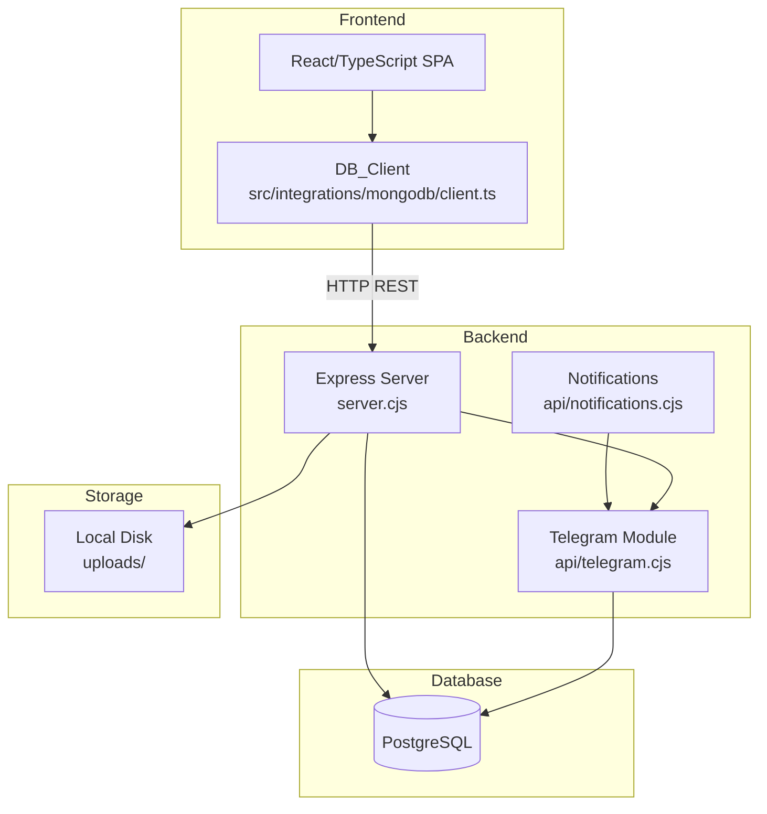
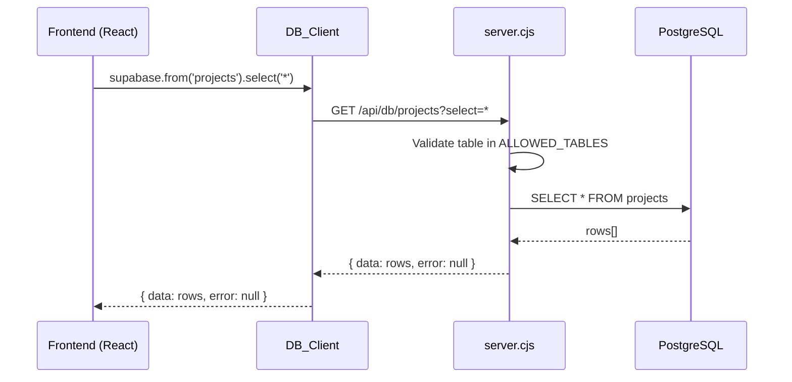

# Design Document: postgres-migration

## Overview

This document describes the technical design for completing the full migration of the React/TypeScript + Express web application to PostgreSQL as the sole database. The application previously used MongoDB (`server-mongo.cjs`) and is partially migrated to PostgreSQL (`server.cjs` + `pg`). The goal is to close all remaining gaps: missing schema tables, schema/server mismatches, migration script correctness, and ensuring every subsystem (Express API, frontend client, Telegram integration, file storage) operates reliably against PostgreSQL.

### Key Findings from Codebase Analysis

After reviewing `server.cjs`, `db/schema.sql`, `src/integrations/mongodb/client.ts`, `api/telegram.cjs`, and `api/notifications.cjs`, the following concrete gaps were identified:

1. **Missing tables in `db/schema.sql`**: `ALLOWED_TABLES` in `server.cjs` references `gallery_items`, `hero_carousel`, `system_settings`, `bitrix_leads`, `project_orders`, `blog_images`, and `review_images` — none of which exist in `db/schema.sql`.
2. **Missing column `client_stage` in `users`**: `server.cjs` queries `client_stage` from `users` at login, but `db/schema.sql` does not define this column.
3. **Missing columns in `form_submissions`**: `server.cjs` inserts `topic`, `custom_topic`, `source` and queries `is_pinned`, `pinned_at` — none of these are in `db/schema.sql`.
4. **`buildWhereClause` placeholder bug**: The function uses `${idx++}` without the `$` prefix, producing invalid SQL like `field = 1` instead of `field = $1`.
5. **`LIMIT/OFFSET` placeholder bug** in `/api/admin/users/list` and `/api/admin/forms/list`: uses `LIMIT $${idx} OFFSET $${idx + 1}` with wrong index arithmetic.
6. **`mongoose` still in `package.json` dependencies**: The package is still listed even though `server.cjs` no longer uses it.
7. **No `scripts/` migration directory**: Requirements reference `scripts/` but no such directory exists; migration SQL lives in `db/`.
8. **`db/schema.sql` trigger dollar-quoting**: Uses `$` instead of `$$` for PL/pgSQL function body, which will fail on standard PostgreSQL.

---

## Architecture

The system follows a three-tier architecture:



### Request Flow



---

## Components and Interfaces

### 1. Express Server (`server.cjs`)

The central component. All changes are additive fixes — no architectural changes.

**Startup validation** (already implemented, confirmed correct):
- Checks `DB_HOST`, `DB_PORT`, `DB_NAME`, `DB_USER`, `DB_PASSWORD` and exits with code 1 if any are missing.
- Creates upload directories on startup.

**Generic CRUD API** (`/api/db/:collection`):
- `GET` — SELECT with filters, ordering, limit, head-count mode
- `POST` — INSERT or UPSERT (via `operation: "upsert"`)
- `PATCH` — UPDATE with filters
- `DELETE` — DELETE with required filters

**Fix required — `buildWhereClause`**: The current implementation produces `field = 1` instead of `field = $1`. The fix is to prepend `$` to each placeholder:

```javascript
// BEFORE (broken)
conditions.push(`${safeField} = ${idx++}`);

// AFTER (correct)
conditions.push(`${safeField} = $${idx++}`);
```

**Fix required — LIMIT/OFFSET in paginated queries**: In `/api/admin/users/list` and `/api/admin/forms/list`, the LIMIT/OFFSET are appended as literal values in the SQL string but the params array uses wrong indices. The fix is to use consistent parameterized placeholders.

**Auth endpoints**: `/api/auth/signup`, `/api/auth/login`, `/api/auth/logout`, `/api/auth/session`, `/api/auth/user` — all implemented and correct.

**Admin Dashboard** (`/api/admin/dashboard/summary`): Already implemented with a single parallel `Promise.all` query. No changes needed.

### 2. Database Schema (`db/schema.sql`)

The single source of truth for the PostgreSQL schema. The following additions are required:

**Missing column — `users.client_stage`**:
```sql
ALTER TABLE users ADD COLUMN IF NOT EXISTS client_stage VARCHAR(100);
```
Or added inline to the `CREATE TABLE users` definition.

**Missing columns — `form_submissions`**:
```sql
topic VARCHAR(255),
custom_topic VARCHAR(255),
source VARCHAR(100),
is_pinned BOOLEAN DEFAULT false,
pinned_at TIMESTAMPTZ,
updated_at TIMESTAMPTZ DEFAULT NOW()
```

**Missing tables** (to be added to `db/schema.sql`):

| Table | Purpose |
|---|---|
| `gallery_items` | Public gallery images |
| `hero_carousel` | Homepage carousel slides |
| `system_settings` | Key-value app configuration |
| `bitrix_leads` | Cached Bitrix24 CRM leads |
| `project_orders` | Client project order requests |
| `blog_images` | Images attached to blog posts |
| `review_images` | Images attached to reviews |

**Fix required — trigger dollar-quoting**: The `update_updated_at_column` function uses single `$` delimiters which are invalid. Must use `$$`:

```sql
-- BEFORE (broken)
CREATE OR REPLACE FUNCTION update_updated_at_column()
RETURNS TRIGGER AS $
BEGIN ...
END;
$ language 'plpgsql';

-- AFTER (correct)
CREATE OR REPLACE FUNCTION update_updated_at_column()
RETURNS TRIGGER AS $$
BEGIN ...
END;
$$ language 'plpgsql';
```

### 3. Frontend DB Client (`src/integrations/mongodb/client.ts`)

The `QueryBuilder` class that translates Supabase-like calls into HTTP requests. Already largely correct. One confirmed issue:

**`maybeSingle()` implementation**: The current implementation calls `this.then(...)` which works but is slightly fragile. It is functionally correct — returns `null` when no rows found, no exception thrown.

**Token storage**: Correctly stores JWT in `localStorage` under `mongo_auth_token` and sends it as `Authorization: Bearer <token>` on all requests.

**JSONB fields**: The client sends plain JS objects; the server serializes them to JSON strings before writing to PostgreSQL. This is correct.

### 4. Telegram Module (`api/telegram.cjs`)

Uses its own `pg.Pool` with the same env vars as `server.cjs`. All endpoints are implemented and correct. The token expiry check (10-minute window) is implemented via `created_at >= NOW() - INTERVAL '10 minutes'`.

### 5. File Storage

Multer-based disk storage under `uploads/`. Directories are created at server startup. The `getPublicUrl` method in `DB_Client` constructs URLs as `${API_BASE}/uploads/${bucket}/${filePath}` which matches the static file serving at `/uploads`.

---

## Data Models

### Core Tables (already in `db/schema.sql`)

```
users
  id UUID PK
  email VARCHAR(255) UNIQUE NOT NULL
  password_hash VARCHAR(255) NOT NULL
  username VARCHAR(255)
  phone VARCHAR(50)
  avatar TEXT
  client_stage VARCHAR(100)          ← ADD THIS
  role VARCHAR(50) DEFAULT 'client'
  created_at TIMESTAMPTZ
  updated_at TIMESTAMPTZ

form_submissions
  id UUID PK
  form_type VARCHAR(50) NOT NULL
  topic VARCHAR(255)                 ← ADD THIS
  custom_topic VARCHAR(255)          ← ADD THIS
  source VARCHAR(100)                ← ADD THIS
  data JSONB NOT NULL
  status VARCHAR(50) DEFAULT 'new'
  is_pinned BOOLEAN DEFAULT false    ← ADD THIS
  pinned_at TIMESTAMPTZ              ← ADD THIS
  processed BOOLEAN DEFAULT false
  processed_at TIMESTAMPTZ
  processed_by UUID REFERENCES users(id)
  updated_at TIMESTAMPTZ DEFAULT NOW() ← ADD THIS
  created_at TIMESTAMPTZ
```

### Missing Tables (to be added to `db/schema.sql`)

```sql
CREATE TABLE IF NOT EXISTS gallery_items (
  id UUID PRIMARY KEY DEFAULT gen_random_uuid(),
  title VARCHAR(255),
  image_url TEXT NOT NULL,
  category VARCHAR(100),
  display_order INTEGER DEFAULT 0,
  is_published BOOLEAN DEFAULT false,
  created_at TIMESTAMPTZ DEFAULT NOW(),
  updated_at TIMESTAMPTZ DEFAULT NOW()
);

CREATE TABLE IF NOT EXISTS hero_carousel (
  id UUID PRIMARY KEY DEFAULT gen_random_uuid(),
  title VARCHAR(255),
  subtitle TEXT,
  image_url TEXT NOT NULL,
  link_url TEXT,
  display_order INTEGER DEFAULT 0,
  is_active BOOLEAN DEFAULT true,
  created_at TIMESTAMPTZ DEFAULT NOW(),
  updated_at TIMESTAMPTZ DEFAULT NOW()
);

CREATE TABLE IF NOT EXISTS system_settings (
  id UUID PRIMARY KEY DEFAULT gen_random_uuid(),
  key VARCHAR(255) UNIQUE NOT NULL,
  value JSONB,
  description TEXT,
  updated_at TIMESTAMPTZ DEFAULT NOW()
);

CREATE TABLE IF NOT EXISTS bitrix_leads (
  id UUID PRIMARY KEY DEFAULT gen_random_uuid(),
  external_id VARCHAR(255) UNIQUE,
  name VARCHAR(255),
  email VARCHAR(255),
  phone VARCHAR(50),
  status_id VARCHAR(100),
  source_id VARCHAR(100),
  raw_data JSONB,
  created_at TIMESTAMPTZ DEFAULT NOW(),
  updated_at TIMESTAMPTZ DEFAULT NOW()
);

CREATE TABLE IF NOT EXISTS project_orders (
  id UUID PRIMARY KEY DEFAULT gen_random_uuid(),
  user_id UUID REFERENCES users(id) ON DELETE SET NULL,
  project_id UUID REFERENCES projects(id) ON DELETE SET NULL,
  status VARCHAR(50) DEFAULT 'new',
  data JSONB,
  created_at TIMESTAMPTZ DEFAULT NOW(),
  updated_at TIMESTAMPTZ DEFAULT NOW()
);

CREATE TABLE IF NOT EXISTS blog_images (
  id UUID PRIMARY KEY DEFAULT gen_random_uuid(),
  blog_id UUID NOT NULL REFERENCES blog_posts(id) ON DELETE CASCADE,
  image_url TEXT NOT NULL,
  display_order INTEGER DEFAULT 0,
  created_at TIMESTAMPTZ DEFAULT NOW()
);

CREATE TABLE IF NOT EXISTS review_images (
  id UUID PRIMARY KEY DEFAULT gen_random_uuid(),
  review_id UUID NOT NULL REFERENCES reviews(id) ON DELETE CASCADE,
  image_url TEXT NOT NULL,
  display_order INTEGER DEFAULT 0,
  created_at TIMESTAMPTZ DEFAULT NOW()
);
```

---

## Correctness Properties

*A property is a characteristic or behavior that should hold true across all valid executions of a system — essentially, a formal statement about what the system should do. Properties serve as the bridge between human-readable specifications and machine-verifiable correctness guarantees.*

### Property 1: Missing env vars cause server exit

*For any* non-empty subset of the required DB environment variables (`DB_HOST`, `DB_PORT`, `DB_NAME`, `DB_USER`, `DB_PASSWORD`) that is absent, the server startup process SHALL exit with code 1.

**Validates: Requirements 1.3**

---

### Property 2: Schema idempotency

*For any* PostgreSQL database that has already had `db/schema.sql` applied, running `db/schema.sql` again SHALL produce zero errors.

**Validates: Requirements 2.5, 8.2**

---

### Property 3: SQL filter parameterization

*For any* set of filter objects passed to `buildWhereClause`, every generated condition SHALL use a `$N` placeholder and the corresponding value SHALL appear in the params array at the correct index — never interpolated directly into the SQL string.

**Validates: Requirements 3.1**

---

### Property 4: Upsert round-trip

*For any* valid record inserted into a table, upserting that same record with modified fields SHALL return the updated field values, not the original ones.

**Validates: Requirements 3.2**

---

### Property 5: JSONB object round-trip

*For any* record containing object-valued (JSONB) fields, writing it via PATCH or POST and then reading it back via GET SHALL return an object equal to the original.

**Validates: Requirements 3.3**

---

### Property 6: password_hash never exposed

*For any* GET request to `/api/db/users` or any auth endpoint that returns user data, the response body SHALL NOT contain a `password_hash` field.

**Validates: Requirements 3.5**

---

### Property 7: Signup creates user and profile

*For any* valid email/password pair not already registered, calling POST `/api/auth/signup` SHALL create exactly one row in `users` and one row in `user_profiles` with the same `id`, and SHALL return a JWT token.

**Validates: Requirements 4.1**

---

### Property 8: Login returns clientStage

*For any* registered user, calling POST `/api/auth/login` with correct credentials SHALL return a response containing a `clientStage` field (which may be `null` if unset).

**Validates: Requirements 4.2**

---

### Property 9: Invalid credentials return 401

*For any* email/password combination where either the email does not exist or the password does not match, POST `/api/auth/login` SHALL return HTTP status 401.

**Validates: Requirements 4.3**

---

### Property 10: Auth middleware rejects invalid tokens

*For any* protected endpoint, a request with a missing, malformed, or expired Bearer token SHALL receive HTTP status 401 or 403 and SHALL NOT receive the protected resource.

**Validates: Requirements 4.5**

---

### Property 11: Telegram token generation creates DB record

*For any* valid `userId`, calling POST `/api/telegram/generate-token` SHALL insert exactly one row into `telegram_link_tokens` and SHALL return a URL containing that token.

**Validates: Requirements 5.2**

---

### Property 12: File upload round-trip

*For any* file uploaded via POST `/api/storage/:bucket/upload`, the returned `path` SHALL correspond to a file that exists on disk under `uploads/:bucket/`.

**Validates: Requirements 6.1**

---

### Property 13: DB_Client error passthrough

*For any* server response containing an `error` field, the `DB_Client` SHALL return `{ data: null, error }` without throwing a JavaScript exception.

**Validates: Requirements 9.4**

---

### Property 14: DB_Client token propagation

*For any* successful login via `auth.signInWithPassword`, all subsequent `QueryBuilder` requests SHALL include an `Authorization: Bearer <token>` header matching the token returned by login.

**Validates: Requirements 9.3**

---

## Error Handling

### Server-level

| Scenario | Behavior |
|---|---|
| Missing DB env vars at startup | `process.exit(1)` with descriptive message |
| Table not in `ALLOWED_TABLES` | HTTP 404 `{ error: "Table not found" }` |
| DELETE with no filters | HTTP 400 `{ error: "Filters are required" }` |
| PostgreSQL query error | HTTP 500 `{ error: { message: err.message } }` |
| Invalid JWT token | HTTP 401 `{ error: "Неверный токен" }` |
| Insufficient role | HTTP 403 `{ error: "Недостаточно прав" }` |
| Duplicate email on signup | HTTP 400 `{ error: "Пользователь уже существует" }` |
| Wrong credentials on login | HTTP 401 `{ error: "Неверный email или пароль" }` |

### DB_Client-level

All errors from the server are returned as `{ data: null, error: { message: string } }`. The client never throws — all error paths return the error object. This is already implemented correctly.

### Telegram Module

- Missing `userId` → HTTP 400
- Expired/used token → HTTP 400
- Telegram API failure → logged, returns `{ success: false, error }`
- Missing `TELEGRAM_BOT_TOKEN` → returns `{ success: false, error: "TELEGRAM_BOT_TOKEN не задан" }`

### File Storage

- No file in upload request → HTTP 400
- File deletion of non-existent path → silently succeeds (already implemented with `fs.existsSync` guard)
- File size exceeds 50 MB → Multer rejects with error

---

## Testing Strategy

This feature is primarily a migration/fix effort. The testing approach combines smoke tests (verifying structural correctness), integration tests (verifying DB interactions), and property-based tests (verifying universal invariants in the logic layer).

### Property-Based Testing

Property-based testing is applicable here because several components contain pure or near-pure logic that varies meaningfully with input: the `buildWhereClause` function, the JSONB serialization logic, the auth flow, and the DB_Client error handling.

**Library**: [fast-check](https://github.com/dubzzz/fast-check) for TypeScript/JavaScript.

Each property test runs a minimum of **100 iterations**.

Tag format: `// Feature: postgres-migration, Property N: <property_text>`

**Property 3 — SQL filter parameterization** (unit test on `buildWhereClause`):
```javascript
// Feature: postgres-migration, Property 3: filter parameterization
fc.assert(fc.property(
  fc.array(fc.record({ op: fc.constantFrom('eq','neq','gt','lt','gte','lte','like','ilike'), field: fc.string(), value: fc.anything() })),
  (filters) => {
    const { where, params } = buildWhereClause(filters);
    // Every $N in where clause must have a corresponding params entry
    const placeholders = (where.match(/\$\d+/g) || []).map(p => parseInt(p.slice(1)));
    return placeholders.every(n => n <= params.length + 1);
  }
));
```

**Property 6 — password_hash never exposed** (integration test with test DB):
```javascript
// Feature: postgres-migration, Property 6: password_hash never exposed
fc.assert(fc.property(
  fc.record({ email: fc.emailAddress(), password: fc.string({ minLength: 8 }) }),
  async ({ email, password }) => {
    const res = await request(app).get('/api/db/users');
    const body = JSON.parse(res.text);
    const rows = body.data || [];
    return rows.every(row => !('password_hash' in row));
  }
));
```

**Property 13 — DB_Client error passthrough** (unit test with mocked fetch):
```javascript
// Feature: postgres-migration, Property 13: DB_Client error passthrough
fc.assert(fc.property(
  fc.record({ message: fc.string() }),
  async (errorObj) => {
    global.fetch = jest.fn().mockResolvedValue({
      json: () => Promise.resolve({ error: errorObj }),
      text: () => Promise.resolve(JSON.stringify({ error: errorObj }))
    });
    const result = await supabase.from('users').select('*');
    return result.data === null && result.error !== null;
  }
));
```

### Unit Tests

Focus on specific examples and edge cases:

- `buildWhereClause` with empty filters → empty WHERE clause
- `buildWhereClause` with `is: null` → `IS NULL` (no placeholder)
- DELETE with no filters → HTTP 400
- GET with `head=true` → returns `count`, `data: null`
- `maybeSingle()` on empty result → `{ data: null, error: null }`
- `select("*", { count: "exact", head: true })` → request includes `head=true`

### Integration Tests

Run against a real test PostgreSQL instance (or Docker container):

- Apply `db/schema.sql` twice → no errors on second run
- Apply `db/schema.sql` once → all 25 required tables exist
- POST `/api/auth/signup` → user and profile rows created
- POST `/api/auth/login` → returns `clientStage` field
- POST `/api/auth/login` with wrong password → HTTP 401
- POST `/api/db/users` (upsert) → returns updated record
- PATCH `/api/db/user_profiles` with JSONB field → round-trip preserves object

### Smoke Tests

- `server.cjs` contains no `require('mongoose')` or `require('mongodb')`
- `db/schema.sql` contains `client_stage` column in `users` table
- `db/schema.sql` contains all 7 previously missing tables
- `ALLOWED_TABLES` in `server.cjs` matches all tables in `db/schema.sql`
- `api/telegram.cjs` uses `DB_HOST`, `DB_PORT`, `DB_NAME`, `DB_USER`, `DB_PASSWORD` env vars
- Upload directories exist after server start
